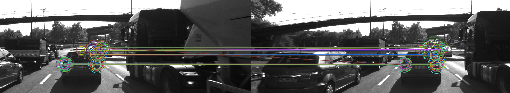

# 2D Feature Tracking
## Sensor Fusion Engineer Nanodegree

The purpose of this project is to discover the most appropriate combination of 
key-point detectors, descriptors, and matching techniques for the collision 
avoidance system relying upon the Time-to-Collision (TTC) metric 
calculated based on the sequence of images provided by a mono camera mounted 
on top of a vehicle based on the trade-off 
between the number of key-points discovered, 
the number of matches between the consecutive images 
and the processing time required 
to produce one estimation of TTC.

The default OpenCV implementation parameters were used 
for each entity (detectors, descriptors, matchers, selectors). 
The measurements were taken on a laptop having the 
GPU: NVIDIA GeForce GTX 1060 Max-Q 6GiB; 
CPU: Intel Core i7-8750H; 
RAM: 16 GiB.

#### Keypoints Statistics

To see all the details, open the image above in a new tab and zoom.

#### Matches Statistics

To see all the details, open the image above in a new tab and zoom.

#### Timings Statistics
  
To see all the details, open the image above in a new tab and zoom.
The values near each box present the mean values.

#### Analysis

##### Number of Keypoints
Below is a list of keypoint detectors sorted in descending order 
based on the mean number of keypoints identified among 10 images. 
The analysis is based on the keypoint data presented in the section 
[Keypoints Statistics](#keypoints-statistics).   

| BRISK | AKAZE | FAST | SIFT | SHITOMASI | ORB | HARRIS |
|-------|-------|------|------|-----------|-----|--------|
| 276   | 167   | 149  | 138  | 117       | 116 | 24     |

##### Number of Matches
Below is a list of TOP-5 combinations of detector+descriptor sorted 
in descending order based on the mean number of identified matches 
among 9 pairs of 10 consecutive images. 
The analysis is based on the matches data presented in the section 
[Matches Statistics](#matches-statistics).   

| Place     | Combination(s)                                                            |  
|-----------|---------------------------------------------------------------------------|  
| 1st (278) | BRISK+SIFT, BRISK+BRIEF, BRISK+BRISK, BRISK+ORB                           |  
| 2nd (258) | BRISK+FREAK                                                               |  
| 3rd (165) | AKAZE+SIFT, AKAZE+FREAK, AKAZE+ORB, AKAZE+AKAZE, AKAZE+BRIEF, AKAZE+BRISK |  
| 4th (149) | FAST+BRIEF, FAST+SIFT, FAST+BRISK, FAST+ORB, FAST+FREAK                   |
| 5th (138) | SIFT+BRISK, SIFT+BRIEF, SIFT+SIFT                                         |

##### Timings
Below is a list of TOP-5 detectors sorted 
in descending order based on the mean time required to identify keypoints in one image. 
The analysis is based on the timings data presented in the section 
[Timings Statistics](#timings-statistics).   

| FAST    | ORB     | HARRIS  | SHITOMASI | BRISK    |  
|---------|---------|---------|-----------|----------| 
| 0.74 ms | 5.22 ms | 8.86 ms | 9.29 ms   | 27.07 ms | 

Below is a list of TOP-5 descriptors sorted 
in descending order based on the mean time required to compute a set of descriptors 
for all the keypoints in one image. 
The analysis is based on the timings data presented in the section 
[Timings Statistics](#timings-statistics).  

| BRIEF   | BRISK   | ORB     | SIFT     | AKAZE    |  
|---------|---------|---------|----------|----------|  
| 0.59 ms | 1.28 ms | 1.73 ms | 15.41 ms | 29.16 ms |  

##### TOP-3 Detector+Descriptor Combinations
Assuming that the number of keypoints, number of matches, and timings 
ratings contribute equally, the TOP-3 detector-descriptor combinations 
are chosen.  

| Place                            | Combination | Score              |
|----------------------------------|-------------|--------------------|  
| 1st place (if you value accuracy)| BRISK+BRIEF | 8 = 1 + 1 + 5 + 1  | 
| 2nd place (if you value speed)   | FAST+BRIEF  | 9 = 3 + 4 + 1 + 1  |   
| 2nd place (if you value accuracy)| BRISK+BRISK | 9 = 1 + 1 + 5 + 2  | 
| 3rd place (if you value speed)   | FAST+BRISK  | 10 = 3 + 4 + 1 + 2 | 

##### Summary
The choice between BRISK+BRIEF and FAST+BRIEF should be based 
on the hardware available and accuracy requirements. 
From visual observations it is clear that both combinations produce some 
false matches on each pair of images, that is why it is probably better 
to choose FAST+BRIEF combination for collision avoidance system, 
given the significant gap between the FAST and BRISK keypoint 
detection times.

The winner is **FAST detector + BRIEF descriptor** combination.
