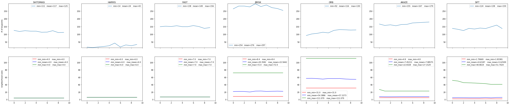
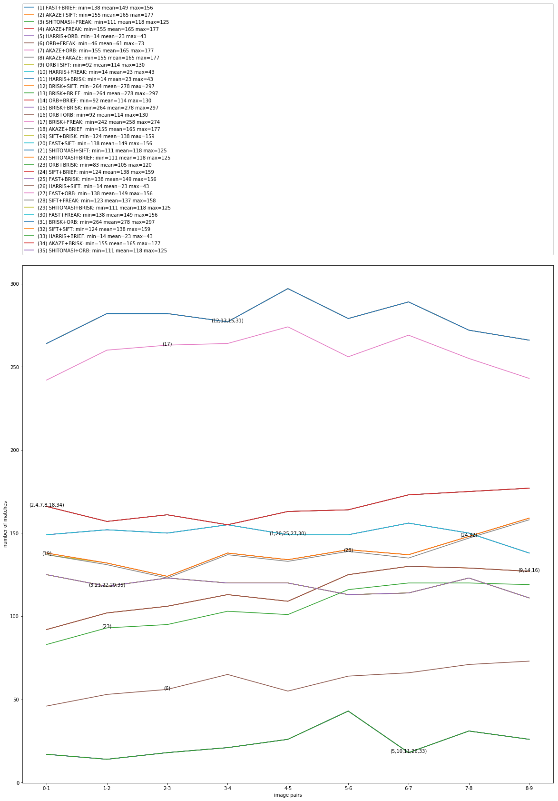
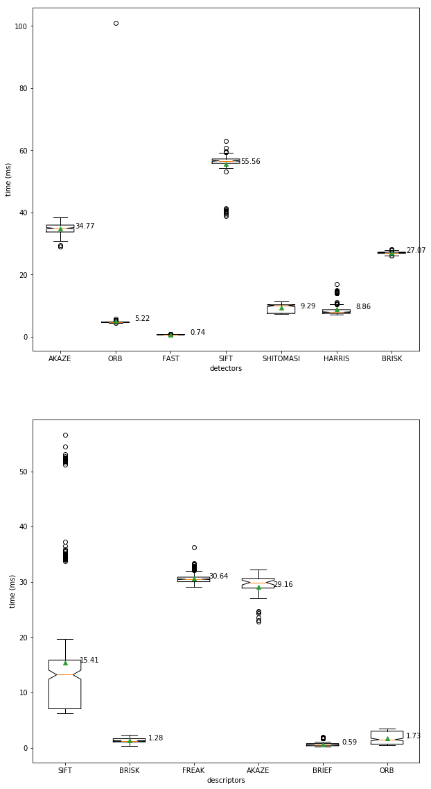

# 2D Feature Tracking
## Sensor Fusion Engineer Nanodegree

The purpose of this project is to discover the most appropriate combination of 
key-point detectors, descriptors, and matching techniques for the collision 
avoidance system relying upon the Time-to-Collision (TTC) metric 
calculated based on the sequence of images provided by a mono camera mounted 
on top of a vehicle based on the trade-off 
between the number of key-points discovered, 
the number of matches between the consecutive images 
and the processing time required 
to produce one estimation of TTC.

#### Keypoints Statistics

To see all the details, open the image above in a new tab and zoom.

#### Matches Statistics

To see all the details, open the image above in a new tab and zoom.

#### Timings Statistics

The values near each box present the mean values.  
To see all the details, open the image above in a new tab and zoom.

#### Analysis
